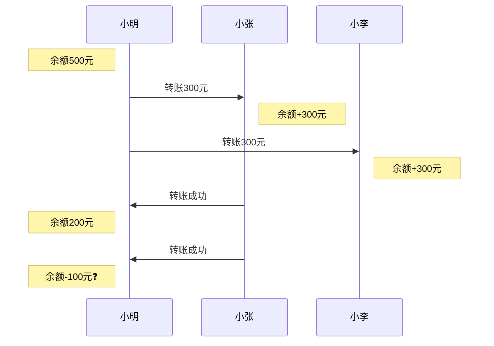
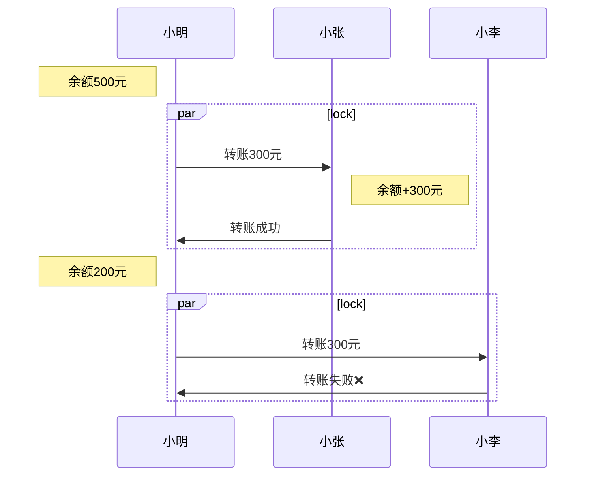

啦啦啦，啦啦啦，我是个卖锁的小行家~

呀！一不小心，我的锁掉河里了o(╥﹏╥)o

这时候，从河里浮上来一位河神，他捞起一把悲观锁，问我：“这是你掉的锁吗？”

我看了一眼，说：“不是。”

河神再次从河里捞起一把非公平锁，问我：“这是你的锁吗？”

我摇摇头说：“不是。”

河神又一次从河里捞起一把排它锁，问我：“这是你的锁吗？”

我看了一眼锁，然后转头对河神说：“你之前也是程序员吗？”

## 为什么要有锁

当数据/资源只有一份，而为了提高性能，有多个线程或者client同时操作该数据/资源的时候，会出现结果不正确或者不一致的情况。比如，小明有500块钱，同时给小张和小李各转300块时，可能会出现下图中的情况：



为了避免这种情况的发生，该数据/资源在同一时间下只能被其中一个线程或者client操作，而控制这种流程的机制就是锁。



## 锁的分类

+ 是否加锁
  + 乐观锁：乐观锁又被称为无锁，也就是说乐观锁并不会对资源进行加锁，而是在提交修改的时候检查资源是否被其他线程/client修改过，检查的方式主要有对比修改前的值（CAS）和对比数据版本
  + 悲观锁：悲观锁会独占式地对操作资源进行加锁
+ 允许几个操作者（线程/client）同时操作
  + 共享锁、读锁：允许多个操作者同时操作，多用于读取资源的场景；但是加了共享锁之后不允许加排它锁
  + 排它锁（互斥锁、独占锁）、写锁：只允许一个操作者对资源进行操作和访问
+ 锁是否先到先得
  + 公平锁：先尝试获取锁的操作者优先得到锁
  + 非公平锁：不讲武德，后来的操作者可能先得到锁，但是在java中可以减少唤起阻塞线程的开销
+ 对同一个操作者而言是否允许重复获取锁
  + 可重入锁：允许同一个操作者重复获取同一把锁，可一定程度避免死锁
  + 非可重入锁：不允许同一个操作者重复获取同一把锁
+ 没有得到锁的操作者是否会循环获取锁
  + 自旋锁：没有得到锁的操作者会循环获取锁
  + 非自旋锁：没有得到锁的操作者会进入阻塞状态
+ 在等待锁的过程中是否可以放弃
  + 可中断锁：在等待锁的过程中可以放弃
  + 不可中断锁：不撞南墙不回头，在等待锁的过程中不可以放弃

## 浅析各个地方的锁

### Java中的锁
Java中`synchronized`和`Lock`属于悲观锁，`AtomicInteger`（`Atomic*`）使用CAS实现原子操作，而`AtomicStampedReference`解决了ACS的ABA问题

Java中CAS的实现原理：在C++中调用`cmpxchg`指令，而`cmpxchg`指令不是原子性的，因此在多核处理器中会增加`lock`前缀

+ `synchronized`
  + 分类：悲观锁、排它锁、非公平锁、可重入锁、在某些情况下会自旋（重量级锁竞争失败），不可中断锁

  + 3种使用方式
    1. 同步代码块
    ```
    public void func() {
        synchronized (object) {
            // ...
        }
    }
    ```
    2. 同步方法，等同于`synchronized(this)`
    ```
    public synchronized void func() {
        // ...
    }
    ```
    3. 同步静态方法，等同于`synchronized(Class.class)`
    ```
    public static synchronized void func() {
        // ...
    }
    ```

  + 加锁原理
  Java中每个对象都有一个monitor，而synchronized正是通过monitor实现对对象的互斥访问。monitor中`_owner`属性记录获得monitor的线程，`_count`记录线程获得monitor的次数，`_EntryList`记录等待monitor的线程，`_WaitSet`记录调用了`wait`方法的线程。
    ```
    ObjectMonitor() {
      _header       = NULL;
      _count        = 0;   // 重入次数
      _waiters      = 0,   // 等待线程数
      _recursions   = 0;
      _object       = NULL;
      _owner        = NULL;  // 当前持有锁的线程
      _WaitSet      = NULL;  // 调用了 wait 方法的线程被阻塞 放置在这里
      _WaitSetLock  = 0 ;
      _Responsible  = NULL ;
      _succ         = NULL ;
      _cxq          = NULL ;
      FreeNext      = NULL ;
      _EntryList    = NULL ; // 等待锁 处于block的线程 有资格成为候选资源的线程
      _SpinFreq     = 0 ;
      _SpinClock    = 0 ;
      OwnerIsThread = 0 ;
    }
    ```
    Monitor依赖操作系统的MutexLock实现。
  + 双重检查锁
    考虑下面的代码：
    ```
    // Single-threaded version
    class Foo {
        private Helper helper;
        public Helper getHelper() {
            if (helper == null) {
                helper = new Helper();
            }
            return helper;
        }

        // other functions and members...
    }
    ```
    如果多线程同时调用`getHelper()`方法时，可能会创建多个`Helper`对象，直观的解决办法是对`getHelper()`方法进行加锁：
    ```
    // Correct multithreaded version
    class Foo {
      private Helper helper = null;
      public synchronized Helper getHelper() {
        if (helper == null)
            helper = new Helper();
        return helper;
      }
      // other functions and members...
    }
    ```
    但是，带来的问题是每次获取`Helper`对象时，都会进行加锁操作，而实际上，当第一个`Helper`对象创建完成之后，后续获取`Helper`对象的操作不需要锁住方法。由于加锁会降低性能，因此其中一种优化方式是：
    1. 先判断`Helper`对象是否初始化过，如果初始化过直接返回
    2. 获取锁
    3. 再次判断`Helper`对象是否初始化过，如果其他线程在这之前获取过锁，那么`Helper`对象已经初始化过，可以直接返回
    4. 否则，初始化`Helper`对象
    ```
    class Foo {
      private volatile Helper helper = null;
      public Helper getHelper() {
        if (helper == null)
          synchronized(this) {
            if (helper == null)
              helper = new Helper();
          }
        return helper;
      }
      // other functions and members...
    }
    ```
    思考：上面的代码中对`helper`变量增加了`volatile`关键字，而`synchronized`已经能保证可见性，为什么还要增加`volatile`？
  + 相关方法
    + Object.wait: 释放锁并挂起线程
    + Object.notify: 随机唤醒一个等待锁的挂起线程，等线程获得锁之后继续执行
    + Object.notifyAll: 唤醒所有等待锁的挂起线程，各个线程竞争锁成功后继续执行

+ `Lock`
  + 分类：悲观锁、排它锁、可公平锁可非公平锁(默认)、可重入锁、非自旋锁，可中断锁
  + 相关方法
    + lock: 获取锁，失败会进入阻塞状态
    + lockInterruptibly: 获取锁，失败会进入阻塞状态，同时可以被其他线程中断（`Thread.interrupt`）
    + tryLock: 获取锁，失败返回false
    + unlock: 释放锁
    + newCondition: 创建一个`Condition`对象，作用类似`Object.wait`和`Object.notify`
  + `ReentrantLock`实现原理
    ```mermaid
    classDiagram
    ReentrantLock *--	 FairSync
    ReentrantLock *--	 NonfairSync
    FairSync --|> Sync
    NonfairSync --|> Sync
    Sync --|> AbstractQueuedSynchronizer
    ```
    + `AbstractQueuedSynchronizer`
    `AbstractQueuedSynchronizer`是JUC包的基石，它内部使用FIFO队列（CLH变体）记录等待线程以及一个int类型的`state`字段记录同步状态。当一个线程尝试获取锁失败后，它会被放入FIFO队列，当等待的锁被释放后，从FIFO队列取出第一个线程进行唤醒。因此，`AbstractQueuedSynchronizer`提供了公平锁的实现方式，而`ReentrantLock`中非公平锁的实现方式则是忽略`AbstractQueuedSynchronizer`中的FIFO队列，先使用CAS抢占锁，失败了再放入`AbstractQueuedSynchronizer`中的FIFO队列。

+ `synchronized` vs `ReentrantLock`
由前面的介绍可知，`synchronized`和`ReentrantLock`都是悲观锁、排它锁、可重入锁，区别是`synchronized`是非公平锁，而`ReentrantLock`即可实现公平锁也可以实现非公平锁；在某些情况下`synchronized`会进行自旋，而`ReentrantLock`不会自旋；`synchronized`不可被中断，而`ReentrantLock`可以被中断。除此之外，`ReentrantLock`还提供了`tryLock`尝试获取锁的方法，可避免一些不必要的阻塞，以及`synchronized`由JVM实现，而`ReentrantLock`是由JDK实现。

### Mysql中的锁

按照锁分类中的定义，Mysql中主要有读锁（共享锁）和写锁（排他锁），而根据锁数据的范围，又可以分为全局锁、表级锁、页级锁、行级锁。

+ 全局锁
  全局锁只有读锁，命令为:
  ```
  flush tables with read lock;
  ```
  执行后，整个数据库中的数据更新语句（insert、update、delete）和数据定义语句（DDL）会被阻塞。
  释放命令为:
  ```
  unlock tables;
  ```
  应用场景：全库数据备份

+ 表级锁
表级锁分为表锁、元数据锁、意向锁和自增锁。

  + 表锁
  支持读锁和写锁，命令为：
    ```
    lock tables ${tableName} read;
    lock tables ${tableName} write;
    ```
    释放命令为：
    ```
    unlock tables;
    ```
  + 元数据锁
  元数据锁（metadata lock，MDL）由数据库隐式自动加锁，对表执行DML时，自动加读锁，对表执行DDL时，自动加写锁，释放时机为事务提交之后。需要注意的地方是数据表已经有读锁的情况下，如果有个客户端对同一张表尝试加写锁，这时候不止会阻塞该写锁，还会阻塞后续的读锁。
  + 意向锁
  意向锁由数据库隐式自动加锁，当申请读行级锁时，自动加意向读锁，当申请写行级锁时，自动加意向写锁。特殊的地方是，意向锁之间不论是读锁还是写锁都不会发生冲突，但是意向锁和表锁会发生冲突，冲突和正常的读写锁一致。
  思考：MyISAM引擎中有意向锁吗？
  + 自增锁（AUTO-INC Lock）
  当`innodb_autoinc_lock_mode=0`时，向包含了`AUTO_INCREMENT`列的表中插入数据时，会持有自增锁，语句执行完成后即释放。

+ 页级锁

  DBD引擎特有概念

+ 行级锁
行级锁包含3种类型，分别是记录锁、间隙锁和包含前两者的临键锁。数据库默认使用临键锁，当只使用记录锁或者间隙锁就可以避免幻读的情况下，临键锁会退化成相应的锁。

  + 记录锁（Record Lock）
  记录锁分为读锁（S锁）和写锁（X锁）
  S锁命令：
    ```
    select ... lock in share mode;
    ```
    隔离级别除Serializable之外的普通select命令不会加S锁。
    X锁命令：
    ```
    select ... for update;
    insert/update/delete
    ```
  + 间隙锁（Gap Lock）
  隔离级别为Repeatable Read或者Serializable时，为防止发生幻读，数据库会自动加上间隙锁来阻止在区间内插入或更新数据。虽然间隙锁分为读锁和写锁，但是两者之间没有区别。间隙锁表现起来像读锁，即可以被多个操作者同时持有。
  + 临键锁（Next-Key Lock）
  临键锁=记录锁+间隙锁，区分读锁和写锁。在隔离级别为Repeatable Read或者Serializable存在。
  + 插入意向锁
  一种特殊的间隙锁，只在insert语句时存在，插入意向锁之间不会发生冲突，但是会和间隙锁和临键锁发生冲突。

+ 乐观锁 vs 悲观锁
以上介绍的Mysql中的锁应该都是悲观锁，乐观锁需要开发者自己实现，如：
  ```
  update table_name set value = new_value, version = new_version where id = id and version = old_version;
  ```

### 分布式锁

本文将介绍3种分布式锁的实现方式，分别是通过数据库实现分布式锁，通过Redis实现分布式锁和通过ZooKeeper实现分布式锁。

+ 通过数据库实现分布式锁
  + 方式一
    1. 尝试对数据行加上写记录锁，比如`select ... for update`
    2. 如果执行成功，则成功获得锁
    3. 如果被阻塞，则说明其他client已经获得对应的写记录锁，需要等待解锁

    锁类型：悲观锁、排它锁、公平锁、非可重入锁、非自旋锁、可中断锁
    优缺点：
    + 优点：持有锁的操作者如果宕机，会自动解锁
    + 缺点：数据库存在单点问题；锁占用数据库连接；锁等待有时间限制，受到数据库配置影响（innodb_lock_wait_timeout）
  + 方式二
    1. 使用CAS对表记录进行更新，如前文介绍的数据库乐观锁实现方式
    2. 如果更新成功，则成功获得锁
    3. 如果更新失败，则说明其他client已经更新过该记录，即已获得锁

    锁类型：乐观锁、排他锁、非公平锁
    优缺点：
    + 优点：无需占用数据库连接；可实现自旋锁和可重入锁
    + 缺点：数据库存在单点问题；无自动解锁机制

+ 通过Redis实现分布式锁
  + 方案一
    1. 使用`SETNX`原子命令对资源进行加锁
    2. 如果设置成功，返回1，成功获得锁，然后使用`EXPIRE`设置过期时间
    2. 如果设置失败，返回0，则说明其他client已经成功获取到锁

    锁类型：悲观锁、排他锁、非公平锁
    优缺点：
    + 优点：有超时解锁机制；可实现自旋锁和可重入锁
    + 缺点：Redis存在单点问题或者在主从复制模式中多次获得锁；`SETNX`和`EXPIRE`是两条命令，如果操作者在这之间宕机，则设置过期时间失败
  + 方案二
    1. 使用`SET key value[EX seconds][PX milliseconds][NX|XX]`原子命令对资源进行加锁并同时设置过期时间
    2. 如果设置成功，返回1，成功获得锁
    2. 如果设置失败，返回0，则说明其他client已经成功获取到锁

    锁类型：悲观锁、排他锁、非公平锁
    优缺点：
    + 优点：有超时解锁机制；可实现自旋锁和可重入锁
    + 缺点：Redis存在单点问题或者在主从复制模式中多次获得锁
  + 方案三
    1. 使用Lua脚本同时执行`SETNX`和`EXPIRE`命令
    2. 如果设置成功，返回1，成功获得锁
    2. 如果设置失败，返回0，则说明其他client已经成功获取到锁

    锁类型和优缺点和方案二一致
  + 方案四
    1. 前提条件：具有N台独立的Redis master服务器
    2. 依次向N台独立的Redis master服务器获取锁，并且判断服务器响应时间是否大于设置的超时时间，如果大于则获取锁失败，立即向下一台服务器获取锁
    3. 统计获取锁成功的服务器数量和总共的加锁时间，如果数量大于N/2+1并且加锁时间小于锁的过期时间，则加锁成功
    4. 如果不满足4的要求，则向所有服务器发送解锁命令

    锁类型：悲观锁、排他锁、非公平锁
    优缺点：
    + 优点：有超时解锁机制
    + 缺点：效率不高

+ 通过ZooKeeper实现分布式锁
  + 方案一
  1. 在ZooKeeper中创建一个临时节点
  2. 如果创建成功，则获得锁
  3. 如果创建失败，则说明其他client已经成功获取到锁，这时候可以监听临时节点的状态，如果临时节点被删除了，会得到通知

  锁类型：悲观锁、排他锁、非公平锁
    优缺点：
    + 优点：持有锁的操作者如果宕机，会自动解锁；可实现可重入锁，实现自旋锁没有意义
    + 缺点：存在惊群效应；架构复杂
  + 方案二
  1. 在ZooKeeper中创建一个临时顺序节点
  2. 判断自己的序号是否是最小的
  3. 如果是最小的，则成功获得锁
  4. 如果不是最小的，则监听前一个节点的状态，当前一个节点释放后，自己即成了序号最小的节点，于是就等于获得了锁

  锁类型：悲观锁、排他锁、公平锁
    优缺点：
    + 优点：持有锁的操作者如果宕机，会自动解锁；可实现可重入锁，实现自旋锁没有意义
    + 缺点：架构复杂

## reference
+ https://www.linkedin.com/pulse/power-locks-threading-nadir-riyani
+ https://en.wikipedia.org/wiki/Optimistic_concurrency_control
+ https://pdai.tech/md/java/thread/java-thread-x-lock-all.html
+ https://www.todocoder.com/bcyy/cp/18.html
+ https://www.cnblogs.com/vipstone/p/15249793.html
+ https://xie.infoq.cn/article/5b2731c61bd4e7966c898314d
+ https://zhuanlan.zhihu.com/p/126384164
+ https://developer.aliyun.com/article/1148359
+ https://www.cnblogs.com/yescode/p/14474104.html
+ https://www.cs.umd.edu/~pugh/java/memoryModel/DoubleCheckedLocking.html
+ https://juejin.cn/post/6844903550586191885
+ https://heapdump.cn/article/3415141
+ https://zhuanlan.zhihu.com/p/45305463
+ https://www.cnblogs.com/keme/p/11065025.html
+ https://www.xiaolincoding.com/mysql/lock/mysql_lock.html
+ https://dev.mysql.com/doc/refman/8.3/en/lock-tables.html
+ https://www.51cto.com/article/707083.html
+ https://juejin.cn/post/6968420054287253540
+ https://tech.taobao.org/news/nz55vx
+ https://dev.mysql.com/doc/refman/8.3/en/innodb-locking.html
+ https://mp.weixin.qq.com/s/KegqAAvI4KxDffforTQqKA
+ https://juejin.cn/post/7178327462869205051
+ https://redis.io/docs/manual/patterns/distributed-locks/
+ https://juejin.cn/post/6976538149904678925
+ https://blog.csdn.net/weixin_42494845/article/details/110195935
+ https://www.51cto.com/article/705985.html
