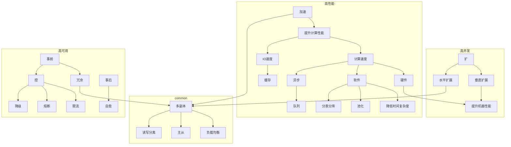

随着互联网成为基础设施，人们的生活也越来越离不开互联网。由于互联网用户数量众多，一个系统如何能支撑更多的用户同时访问，如何能提升系统的响应速度，如何预防和控制故障的发生成为了大型互联网软件设计的三个关键点。而这三个关键点分别就是高并发、高性能和高可用。

高并发、高性能和高可用三个设计点中其实有不少相辅相成、相通之处，比如一个系统如果要做到高并发，势必会有一些可以水平扩展的设计，而水平扩展之后系统的性能会得到提升，也可以认为对系统做了冗余设计，提升了系统的可用性。

## 高并发 (High Concurrency)

系统开发初期，用户量较少，往往一台服务器就能满足需求，而随着用户量的增加，逐渐达到了一台服务器的处理上限。于是要想支撑更多用户同时访问，要么提升这台服务器的处理性能，要么再增加一台或多台服务器。

提升单台服务器的性能被称为垂直扩展，但是由于受到硬件的限制，单台服务器的性能不可能被无限提升，因此这种方式存在一定的瓶颈。但也不是说这种方式就不值得考虑了，服务器的拆分会提升架构的复杂性，服务器数量越多，服务器的管理也会越复杂，因此比较好的方式是在提升服务器性能和增加服务器之间做一些权衡。

增加服务器的方式被称为水平扩展，水平扩展既能提升系统的并发性，又能提升系统的性能，还能提升系统的可用性，一石三鸟，因此更容易受到系统设计者的关注。常见的做法有负载均衡、主从复制、读写分离等。

解决高并发问题的核心就是一个字：扩。

## 高性能 (High Performance)

高性能也就是要求我们的系统可以在较短的时间内处理完用户请求，带来的好处是提升了用户体验，同时由于处理得更快了，在单位时间内就可以处理更多的请求，因此也提升了系统的并发性。

高性能的整体设计思路，我觉得可以从两个角度进行考虑，一是提升单点计算性能，二是提升节点数量。提升单点计算性能又可以分为提升计算速度和提升IO速度。

提升计算速度可以从三个方面考虑，一是提升硬件的计算速度，这种方式的缺点在高并发中已经提到过；二是是提升软件的计算速度，使用时间复杂度较低的算法进行计算，也就是大家常说的代码优化，此外还可以重复利用一些耗时计算的结果，比如使用池化技术；三是减少计算量，算不过来咱就少算一点，比如针对数据库进行分表分库，比如通过消息队列解耦一部分不是核心的计算逻辑，提升主流程的计算速度。

我们知道内存的读写速度要远远大于硬盘的读写速度，访问本地数据的速度要远远大于访问网络数据的速度，因此把数据从硬盘中放入内存进行缓存，把原本需要网络请求的数据缓存在本地都可以提升IO速度。在前端有DNS缓存、HTTP缓存等方案，在后端有本地缓存、分布式缓存等方案。同时，使用缓存也可以减少一些重复计算。

提升节点数量的思路就是让多个节点可以并行计算，以此提升系统的性能，毕竟柴多火焰高。

解决高性能问题的核心就是两个字：加速。

思考：数据库读写分离为什么能提升系统性能？

## 高可用 (High Availability)

最后，我们来看高可用的方案设计思路。服务器硬件是一种不可靠的设备，可能因为断电或故障而宕机；计算机网络也是一种不可靠的设施，可能会出现延迟或者中断等情况。因此，想要提升上层服务的可用性，就要像装有两个引擎的飞机一样，部署多套服务，如果一台服务器挂了，则可以由另外的服务器进行代替。这种冗余设计的思路正好就和高并发方案中增加服务器、高性能方案中提升节点数量的思路一致。

高可用的设计中除了对服务做冗余设计之外，还要考虑的是如何在软件层面避免故障的发生。我们知道当机器的负载较高时，机器的响应速度会变慢甚至变得不可用，因此就需要评估机器的性能，在接近机器负载极限之前就掐断故障的火苗，常见的做法是限流。一个系统中的某个节点发送故障后，往往会发生连锁反应，引起其他依赖该节点的服务也发生故障，针对这个问题的常见解法是熔断。在一些重大活动期间，对于那些重要程度不是很高的服务，还可以采取降级的方式，将计算资源留给核心服务，从而提升整体服务的可用性。

最后要考虑的问题是如果系统已经发生了故障，如何快速地从故障中恢复。论速度的话，计算机的速度肯定比人要快，因此如何快速地从故障中恢复的问题就变成了如何让系统自己恢复。首先，系统要有能感知到故障发生的能力，一般的做法是在节点之间定时发送心跳数据确保各个节点都能正常工作。其次，在一些不对等的服务中，当系统中的决策者（负责接受外部请求，写入数据的master/leader等）出现故障时，跟随者需要有自动切换为决策者的能力。

解决高可用问题需要在故障发生之前预防、避免故障的发生，在故障发生之后系统可以自愈。

## 评估指标

+ 高并发：QPS/TPS，每秒查询数/每秒事务数，大多数情况下两者描述的是同一个指标，同时也是高性能的指标。
+ 高性能：RT，响应时间。一般使用平均值、最大值、分位值来表示，比较有价值的是分位值，比如TP99，代表了99%请求的响应时间。
+ 高可用：SLA，服务等级协议。一般使用几个9来表示，比如999表示一年之内允许的故障时间为8.76个小时（`365*24*(1-0.999)`）。

## reference

+ https://mp.weixin.qq.com/s/sSDjABM5DtOKo2C87rky7g
+ https://cloud.tencent.com/developer/article/1905374
+ https://zq99299.github.io/note-architect/hc/01/03.html
