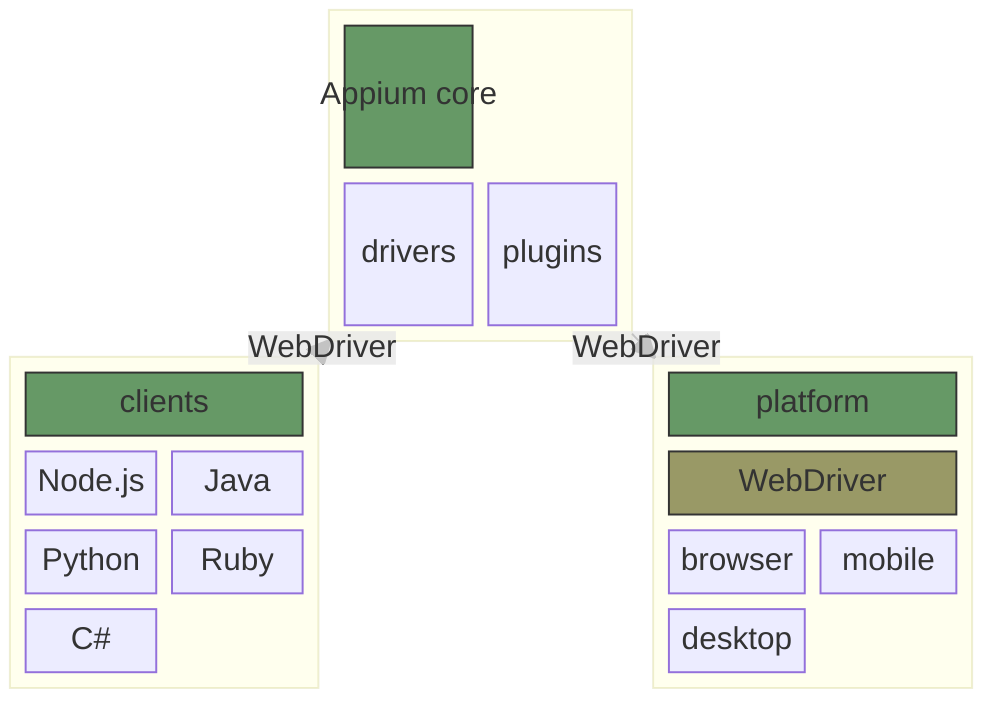

Appium是一个专注于跨平台UI自动化的工具，支持使用多语言编写控制端。

## 组成



+ core 基于扩展的WebDriver协议定义了核心api
+ dirvers 对接各个平台的驱动，通过实现Appium基于WebDriver协议设计的接口，将Appium的操作转换为具体平台的功能
+ clients 支持多语言编写控制端，使用WebDriver协议和core进行交互
+ plugins 扩展了Appium的功能

## 安装

### 依赖

+ 操作系统：macOS, Linux, Windows
+ Node.js(^14.17.0 || ^16.13.0 || >=18.0.0) & npm(>=8)

### Appium

+ 安装Appium
```
npm i -g appium
```

+ 安装Drivers
```
appium driver install <installation key>
```
支持的Drivers可以在这里看：https://appium.io/docs/en/latest/ecosystem/drivers/

## 运行

```
appium
```
看到这些内容就说明启动成功了：
```
[Appium] Welcome to Appium v2.5.1 (REV 552db40622bb7a82d9c6d67d2d6bcf3694b47e30)
[Appium] The autodetected Appium home path: /Users/henry/.appium
[Appium] Attempting to load driver uiautomator2...
[Appium] Requiring driver at /Users/henry/.appium/node_modules/appium-uiautomator2-driver/build/index.js
[Appium] AndroidUiautomator2Driver has been successfully loaded in 1.573s
[Appium] Appium REST http interface listener started on http://0.0.0.0:4723
[Appium] You can provide the following URLs in your client code to connect to this server:
[Appium] 	http://127.0.0.1:4723/ (only accessible from the same host)
[Appium] 	http://192.168.3.87:4723/
[Appium] Available drivers:
[Appium]   - uiautomator2@3.0.5 (automationName 'UiAutomator2')
[Appium] No plugins have been installed. Use the "appium plugin" command to install the one(s) you want to use.
```

## 示例

+ 目标：在安卓系统中，自动打开设置程序，并点击电池菜单
+ 安装依赖：
  + 安装Android Studio，下载地址：https://developer.android.com/studio
  + 安装java
  + 设置环境变量`ANDROID_HOME`和`JAVA_HOME`，例如在mac中可以使用
    ```
    export ANDROID_HOME=/path/to/Library/Android/sdk
    ```
    (需替换正确路径)，其他平台可以参考[这里](https://developer.android.com/tools/variables)
  + 安装Appium dirver：
    ```
    appium driver install uiautomator2
    ```
    安装完之后需要重启appium
+ 运行安卓模拟器

  + 创建一个模拟器并运行
+ 编写Appium client
  ```
  const {remote} = require('webdriverio');

  const capabilities = {
    platformName: 'Android',
    'appium:automationName': 'UiAutomator2',
    'appium:deviceName': 'Android',
    'appium:appPackage': 'com.android.settings',
    'appium:appActivity': '.Settings',
  };

  const wdOpts = {
    hostname: process.env.APPIUM_HOST || 'localhost',
    port: parseInt(process.env.APPIUM_PORT, 10) || 4723,
    logLevel: 'info',
    capabilities,
  };

  async function runTest() {
    const driver = await remote(wdOpts);
    try {
      const batteryItem = await driver.$('//*[@text="Battery"]');
      await batteryItem.click();
    } finally {
      await driver.pause(1000);
      await driver.deleteSession();
    }
  }

  runTest().catch(console.error);
  ```
  如果一切正常的话，在模拟器中设置app会被自动打开，电池菜单会被自动点击

+ 如果遇到下面的错误：
  ```
  unknown error: An unknown server-side error occurred while processing the command. Original error: Could not proxy command to the remote server. Original error: socket hang up
  ```
  可以尝试关闭模拟器后，使用"Cold Boot"重新启动
  

## 概念

+ core
Appium core使用WebDriver协议接受来自client的命令，然后通过给相应的driver发送指令实现对平台的控制。

+ drivers
drivers由Node.js语言编写，实现一个driver的方法是继承`BaseDriver`，然后根据WebDriver协议实现相应的api，具体api和WebDriver协议的映射关系可以在[这里](https://github.com/appium/appium/blob/master/packages/base-driver/lib/protocol/routes.js)找到。针对非浏览器的场景，开发者需要根据WebDriver协议中的语义选用相近的操作来实现，比如查找一个元素对应的操作是获取这个元素的引用。
有些driver里会有两部分，一部分接受client的请求，然后将请求转发给另一部分，另一部分是一个独立的WebDriver服务器（可以不由Node.js编写），负责实现对应平台中的功能，如XCUITest dirver和Safari driver。因此，有时候需要到独立的WebDriver服务器中排查问题。

+ clients
Appium core是基于WebDriver协议设计的，因此client和Appium core之间使用HTTP协议进行通信。client在此基础上，给常见的开发语言（Node.js、Java、Python等）封装了对应的命令，如：
  ```
  const element = await driver.$('//*[@text="Foo"]');
  await element.click();
  console.log(await element.getText())
  console.log(await driver.getPageSource())
  ```

+ Session
Session指client和core之间的一次逻辑连接。
  + Capabilities
    用于定义一次逻辑连接中的不可变参数。如平台名称`platformName`、driver名称`appium:automationName`等，每个driver和plugin支持的参数都不一样，完整的参数列表看[这里](https://appium.io/docs/en/latest/guides/caps/)。以`appium:`作为前缀的参数为Appium在WebDriver基础上扩展的自定义参数。
  + Settings
    Appium额外增加了在一次逻辑连接中可以修改的参数，称为Settings，但是某些driver可能会跨session复用这些参数。Settings支持在初始化时设定和通过api进行修改。

+ 上下文
上下文用于在混合应用程序中切换原生应用和web应用。

+ 扩展命令
由于Appium是WebDriver协议的超集，它定义了2种支持扩展命令的方式：
  1. 定义了兼容WebDriver协议的新接口，这些接口在client中有对应的实现
  2. 通过重载WebDriver客户端中的`Execute Script`命令来支持在driver中执行预先定义好的命令或者是用户自定义的代码

# refenerce
+ https://appium.io/docs/en/latest/quickstart/
+ https://appium.io/docs/en/latest/intro/appium/
+ https://stackoverflow.com/a/73944985
+ https://w3c.github.io/webdriver/#sessions
+ https://appium.io/docs/en/latest/guides/caps/
+ https://appium.io/docs/en/latest/guides/settings/
+ https://appium.io/docs/en/latest/guides/context/
+ https://appium.io/docs/en/latest/guides/execute-methods/
